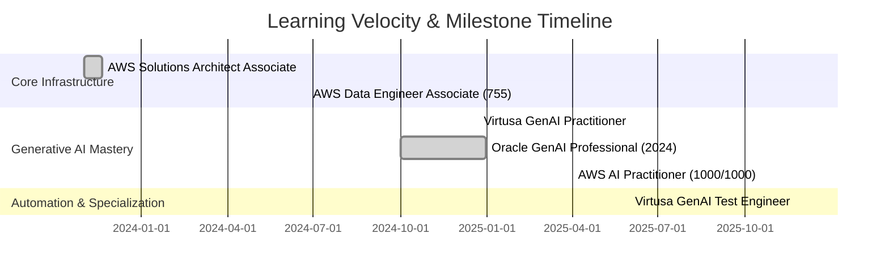

# 🏆 THE ULTIMATE CERTIFICATION HUB

  
  

This is a comprehensive, high-fidelity gallery of **Srisri Jakka's** technical expertise. This vault integrates official repository files with externally verified credentials from **AWS**, **Oracle**, **NVIDIA**, **Stanford**, and **Vanderbilt**.

---

## 📈 The Professional Evolution (2024-2025)

---

## ☁️ Elite AWS Tier (Official Credentials)

| Certification | Performance & Meta | Document |
| :--- | :--- | :--- |
| **AWS Certified AI Practitioner** | 🥇 **1000/1000 (Perfect Score)** | [📜 View](./AWS%20Certified%20AI%20Practitioner%20certificate.pdf) |
| **AWS Data Engineer Associate** | ✅ **Score: 755 (Pass)** | [📜 View](./AWS%20Certified%20Data%20Engineer%20-%20Associate%20certificate.pdf) |
| **AWS Solutions Architect Associate** | 🏗️ **Architectural Excellence** | [📜 View](./AWS%20Certified%20Solutions%20Architect%20-%20Associate%20certificate.pdf) |

---

## 🏹 AWS Cloud Quest Gallery (Interactive Badges)
Verified accomplishments in high-performance cloud domains.

  
  
  
  
  

---

## 🌐 External Multi-Cloud & Academic Excellence
Credentials verified via **External Transcripts**, **Stanford University**, and **NVIDIA Deep Learning Institute**.

| Issuer | Certification | Verification Status |
| :--- | :--- | :--- |
| **Oracle** | **OCI 2024 Generative AI Professional** | ✅ **Verified (2024)** |
| **NVIDIA** | **Generative AI Explained** | ✅ **Verified (DLI)** |
| **Stanford** | **Machine Learning Specialization** | ✅ **Verified (DeepLearning.AI)** |
| **Vanderbilt** | **Prompt Engineering for ChatGPT** | ✅ **Verified (Coursera)** |
| **DeepLearning** | **Generative AI for Everyone** | ✅ **Verified (Andrew Ng)** |

---

## 🤖 GenAI Specialization (Virtusa & Meta)

<b>Featured Spotlight: Project TRACE</b>

 

> [!IMPORTANT]
> **TRACE** was recognized in the **Top 15 GenAI Ideas** by Virtusa's L&D Department.
> - Built RAG pipelines with Pinecone + Mistral/LLaMA.
> - Integrated YouTube Data & Rapid APIs for real-time video analysis.

<b>GenAI Professional Path</b>

 

- [x] **Virtusa GenAI Practitioner**: [Certificate](./Virtusa%20Certified%20GenAI%20Assisted%20Engineer.pdf)
- [x] **Virtusa GenAI Test Engineer**: [Certificate](./Virtusa_GenAI_Assisted_Test_Engineer_Certified.pdf)
- [x] **Meta Llama 3 Development**: [View Spot](./Developing%20with%20Llama%203%20Meta's%20Innovative%20and%20Open%20Large%20Language%20Model.jpg)
- [x] **CrewAI Agentic Systems**: [Review](./Building%20Real-World%20Applications%20with%20CrewAI%20-%20The%20Leading%20Agentic%20AI%20Platform.docx)

---

## 💻 Full Stack & Data Engineering (Java/Python)

<b>Exhaustive Software & Data Catalog (44+ Entries)</b>

 

| Focus Area | Achievement | Link |
| :--- | :--- | :--- |
| **Java** | Oasis Infobyte Full Internship | [Certificate](./CERTIFICATE%20OF%20COMPLETION%20of%20JAVA%20DEVELOPMENT%20internship%20at%20OASIS%20INFOBYTE.pdf) |
| **Python** | Python for Everybody Specialization | [Certificate](./Python%20For%20Everybody%20%20Learn%20Python%20Programming%20MADE%20EASY.pdf) |
| **DevOps** | CI/CD Professional Foundations | [Certificate](./Devops,%20CI%20%26%20CD(Continuous%20Integration%20%26%20Delivery)%20for%20Beginners.pdf) |
| **App Dev** | Android Studio with Java Foundations | [Certificate](./Build%20a%20Simple%20App%20in%20Android%20Studio%20with%20Java.pdf) |
| **Calculus** | Advanced Mathematics for AI | [Certificate](./Introduction%20to%20Calculus.pdf) |
| **FPGA** | Digital Logic & Hardware Design | [View](./Learning%20FPGA%20Development.png) |

*(Plus 38 additional certifications in Web, Data Analytics, and Prompt Engineering...)*

---

### 📫 Let's Connect

---

  Hyper-Visual Vault Archetype v2.0 | Managed by Agentic Automation.

