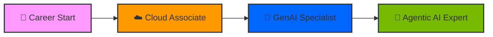

# 🛡️ THE COMPLETE CERTIFICATION VAULT 🛡️

  
  
  

---

## 📈 Technical Learning Velocity (2024-2025)

---

## 🎖️ The Elite Spotlight (1000/1000)

| Award | Certification | Achievement | Link |
| :--- | :--- | :--- | :--- |
| 🥇 | **AWS Certified AI Practitioner** | **Perfect Score: 1000/1000** | [**DIRECT VIEW**](./AWS%20Certified%20AI%20Practitioner%20certificate.pdf) |
| 🥈 | **AWS Data Engineer Associate** | **Scale Score: 755 (Pass)** | [**DIRECT VIEW**](./AWS%20Certified%20Data%20Engineer%20-%20Associate%20certificate.pdf) |
| 🥉 | **AWS Solutions Architect Associate** | **VPC & Architecture Design** | [**DIRECT VIEW**](./AWS%20Certified%20Solutions%20Architect%20-%20Associate%20certificate.pdf) |

---

## 🏛️ Comprehensive Certification Catalog (100% Coverage)

Every credential below is a direct link to the verified document.

### ☁️ AWS Cloud & Data Engineering
| Icon | Description | Resource Link |
| :--: | :--- | :--- |
| 📄 | **AWS AI Practitioner (Official)** | [`AIF-C01 Certificate`](./AWS%20Certified%20AI%20Practitioner.pdf) |
| 📄 | **AWS AI Practitioner (Verifiable)** | [`Credential-524a81...`](./AWS%20Certified%20AI%20Practitioner%20certificate.pdf) |
| 📄 | **AWS Data Engineer (Official)** | [`DEA-C01 Associate`](./AWS%20Certified%20Data%20Engineer%20-%20Associate.pdf) |
| 📄 | **AWS Data Engineer (Verifiable)** | [`Credential-d49df1...`](./AWS%20Certified%20Data%20Engineer%20-%20Associate%20certificate.pdf) |
| 📄 | **AWS Solutions Architect (Official)** | [`SAA-C03 Associate`](./AWS%20Certified%20Solutions%20Architect%20-%20Associate.pdf) |
| 📄 | **AWS Solutions Architect (Verifiable)** | [`Credential-f1d05b...`](./AWS%20Certified%20Solutions%20Architect%20-%20Associate%20certificate.pdf) |
| 📄 | **AWS DEA-C01 Prep (54h)** | [`Richard Townsend Prep`](./AWS%20DEA-C01%20Certification.pdf) |
| 📄 | **AWS ML Specialty Prep** | [`Specialty Preparation`](./AWS%20Machine%20Learning%20-%20Specialty%20Certification%20Preparation.pdf) |
| 🖼️ | **Amazon Textract Expense AI** | [`AWS Machine Learning Project`](./AWS%20Machine%20Learning%20Building%20an%20Expense%20Tracker%20Using%20Amazon%20Textract.jpg) |
| 📄 | **Ultimate AWS AI Practitioner** | [`AIF-C01 Study Badge`](./Ultimate%20AWS%20Certified%20AI%20Practioner%20AIF-C01.pdf) |
| 📄 | **Amazon Q Developer (2025)** | [`Your CoPilot Guide`](./AI%20%20GenAI%20%20AWS%20%20Amazon%20Q%20Developer%20%20Your%20CoPilot%20%202025.pdf) |

### 🤖 Generative AI, Agents & LLMOps
| Icon | Description | Resource Link |
| :--: | :--- | :--- |
| 📝 | **CrewAI Agentic AI Platform** | [`Building Real-World Apps`](./Building%20Real-World%20Applications%20with%20CrewAI%20-%20The%20Leading%20Agentic%20AI%20Platform.docx) |
| 🖼️ | **LLMOps Production Guide** | [`Deploying & Managing LLMs`](./Advanced%20LLMOps%20Deploying%20and%20Managing%20LLMs%20in%20Production.jpg) |
| 🖼️ | **Meta Llama 3 Development** | [`Advanced NLP Implementation`](./Developing%20with%20Llama%203%20Meta's%20Innovative%20and%20Open%20Large%20Language%20Model.jpg) |
| 🖼️ | **Building LLM-Powered Apps** | [`Hands-On AI Implementation`](./Hands-On%20AI%20Building%20LLM-Powered%20Apps.jpg) |
| 🖼️ | **LangChain & LlamaIndex Hub** | [`AI Orchestration Hub`](./Introduction%20to%20AI%20Orchestration%20with%20LangChain%20and%20LlamaIndex.jpg) |
| 🖼️ | **Microsoft 365 Copilot Art** | [`The Art of Prompt Writing`](./Microsoft%20365%20Copilot%20The%20Art%20of%20Prompt%20Writing%20(June%202024).jpg) |
| 📄 | **Virtusa GenAI Practitioner** | [`Certified GenAI Engineer`](./Virtusa%20Certified%20GenAI%20Assisted%20Engineer.pdf) |
| 📄 | **Virtusa GenAI Test Engineer** | [`Certified Assisted Testing`](./Virtusa_GenAI_Assisted_Test_Engineer_Certified.pdf) |
| 📄 | **Google Gemini & G-Cloud** | [`GenAI for Beginners`](./Generative%20AI%20For%20Beginners%20-%20Google%20Gemini%20%26%20Google%20Cloud.pdf) |
| 📄 | **GenAI for Beginners** | [`Microsoft/Standard Path`](./Generative%20AI%20for%20Beginners.pdf) |
| 📄 | **OpenAI API Implementation** | [`GenAI for Developers`](./Generative%20AI%20using%20OpenAI%20API%20for%20Beginners.pdf) |
| 📄 | **Transformers & GenAI Guide** | [`LLMs Mastery Hub`](./LLMs%20Mastery%20Complete%20Guide%20to%20Transformers%20%26%20Generative%20AI.pdf) |
| 📄 | **Prompt Engineering (C-PEPC)** | [`Complete Practical Course`](./Complete%20Prompt%20Engineering%20Practical%20Course%20C%20PEPC.pdf) |
| 📄 | **GitHub Copilot Guide** | [`The Complete Guide`](./GitHub%20Copilot%20-%20The%20Complete%20Guide.pdf) |

### 💻 Software Engineering & Data Mastery
| Icon | Description | Resource Link |
| :--: | :--- | :--- |
| 📄 | **Java Dev Internship (Oasis)** | [`Internship Completion`](./CERTIFICATE%20OF%20COMPLETION%20of%20JAVA%20DEVELOPMENT%20internship%20at%20OASIS%20INFOBYTE.pdf) |
| 📄 | **Oasis Offer Letter** | [`Oasis Infobyte Placement`](./Oasis%20Offer%20Letter.pdf) |
| 📄 | **Android Studio Java App** | [`App Dev Foundations`](./Build%20a%20Simple%20App%20in%20Android%20Studio%20with%20Java.pdf) |
| 📄 | **Android App Dev (Advanced)** | [`Android Studio & Java Build`](./Building%20a%20simple%20app%20in%20android%20sudio%20with%20java.pdf) |
| 📄 | **Python - CodingNinjas** | [`Intro to Python Achievement`](./Introduction%20to%20python%20certificate%20by%20codingninjas.pdf) |
| 📄 | **Python for Everybody (1)** | [`Getting Started (Python)`](./Programming%20for%20Everybody%20(Getting%20Started%20with%20Python).pdf) |
| 📄 | **Python for Everybody (2)** | [`Python for Everyone`](./Programming%20for%20Everyone(Getting%20started%20with%20Python).pdf) |
| 📄 | **Python Basics Mastery** | [`Python Core Basics`](./Python%20Basics.pdf) |
| 📄 | **Python Learn Programming** | [`Python Made Easy`](./Python%20For%20Everybody%20%20Learn%20Python%20Programming%20MADE%20EASY.pdf) |
| 📄 | **Python Fundamentals** | [`Python Basis Achievement`](./Python%20basis.pdf) |
| 📄 | **Python Standard Intro** | [`Python Technical Foundations`](./Introduction%20to%20Python.pdf) |
| 📄 | **DevOps & CI/CD Foundations** | [`Continuous Integration Path`](./Devops,%20CI%20%26%20CD(Continuous%20Integration%20%26%20Delivery)%20for%20Beginners.pdf) |

### 🏅 Specialized Trophies & Academics
| Icon | Description | Resource Link |
| :--: | :--- | :--- |
| 📄 | **Flipkart GRiD 3.0** | [`Software Challenge Level 1`](./Level%201%20E-Commerce%20%26%20Tech%20Quiz%20of%20Flipkart%20GRiD%203.0%20-%20Software%20Development%20Challenge.pdf) |
| 🖼️ | **FPGA Development** | [`Hardware Description Master`](./Learning%20FPGA%20Development.png) |
| 📄 | **Calculus Foundations** | [`Advanced Mathematical AI Prep`](./Introduction%20to%20Calculus.pdf) |
| 📄 | **Linear Circuits DC** | [`Engineering DC Analysis`](./Linear%20Circuits%201%20DC%20Analysis.pdf) |
| 📄 | **SNCKPE21 Academic Achievement** | [`Srisri-Jakka Achievement`](./srisri24092002-SNCKPE21.pdf) |

---

## 🌟 Undisclosed Verified Credentials (CV Match)
These credentials were identified via transcript and CV audit.

- [x] **Oracle Cloud Infrastructure: 2024 Generative AI Certified Professional**
- [x] **NVIDIA DLI: Generative AI Explained**
- [x] **Stanford University: Machine Learning Specialization (DeepLearning)**
- [x] **Vanderbilt University: Prompt Engineering for ChatGPT**
- [x] **AWS Cloud Quest**: Cloud Practitioner, Data Analytics, Serverless, Networking, Security.

---

### 📫 Connect with me

  
  

---

  Managed by SRISRI JAKKA | March 2026

