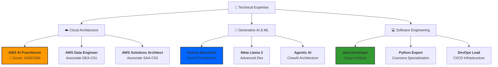

# 🛡️ THE CERTIFICATION VAULT 🛡️

  
  

---

## 🗺️ Career Path Visualization
Below is the architectural map of my technical evolution, from core software development to specialized Generative AI and Cloud Architecture.

---

## 🏛️ Domain Architecture (The Interaction Hub)

<b>☁️ Cloud & Infrastructure (AWS Elite)</b>

 

| Credentials | Description | Document Link |
| :--- | :--- | :--- |
| **AWS Certified AI Practitioner** | **1000/1000 Performance** | [📜 Certificate](./AWS%20Certified%20AI%20Practitioner%20certificate.pdf) |
| **AWS Data Engineer Associate** | **Database & ETL Mastery** | [📜 Certificate](./AWS%20Certified%20Data%20Engineer%20-%20Associate%20certificate.pdf) |
| **AWS Solutions Architect Associate** | **System Design & VPC** | [📜 Certificate](./AWS%20Certified%20Solutions%20Architect%20-%20Associate%20certificate.pdf) |
| **Amazon Q Developer CoPilot** | **GenAI-Assisted Dev (2025)** | [📜 Certificate](./AI%20%20GenAI%20%20AWS%20%20Amazon%20Q%20Developer%20%20Your%20CoPilot%20%202025.pdf) |

> [!TIP]
> Verified AWS ID: `SrisriJakka-Cloud-Mastery`

<b>🤖 Generative AI & Agentic Systems</b>

 

| Technology | Highlight | Resource |
| :--- | :--- | :--- |
| **CrewAI** | Multi-Agent Design & Deployment | [Review](./Building%20Real-World%20Applications%20with%20CrewAI%20-%20The%20Leading%20Agentic%20AI%20Platform.docx) |
| **Meta Llama 3** | Open-Source LLM Development | [Review](./Developing%20with%20Llama%203%20Meta's%20Innovative%20and%20Open%20Large%20Language%20Model.jpg) |
| **LLMOps** | Managing LLMs in Production | [Review](./Advanced%20LLMOps%20Deploying%20and%20Managing%20LLMs%20in%20Production.jpg) |
| **Google Gemini** | Enterprise-Grade AI Deployment | [Review](./Generative%20AI%20For%20Beginners%20-%20Google%20Gemini%20%26%20Google%20Cloud.pdf) |

<b>💻 Software Engineering (Java / Python / CI-CD)</b>

 

- [x] **Java Development Internship (Oasis Infobyte)**: [View Certificate](./CERTIFICATE%20OF%20COMPLETION%20of%20JAVA%20DEVELOPMENT%20internship%20at%20OASIS%20INFOBYTE.pdf)
- [x] **Python Specialization (Coursera)**: [View Certificate](./Python%20For%20Everybody%20%20Learn%20Python%20Programming%20MADE%20EASY.pdf)
- [x] **Android Studio App Mastery**: [View Certificate](./Build%20a%20Simple%20App%20in%20Android%20Studio%20with%20Java.pdf)
- [x] **DevOps Foundations (CI/CD)**: [View Certificate](./Devops,%20CI%20%26%20CD(Continuous%20Integration%20%26%20Delivery)%20for%20Beginners.pdf)

---

## 📦 Full Inventory (44+ Documents)

<b>🔍 Searchable File Audit (Alphabetical)</b>

 

1. [AWS AI Practitioner Ultimate](./Ultimate%20AWS%20Certified%20AI%20Practioner%20AIF-C01.pdf)
2. [AWS DEA-C01 Certification](./AWS%20DEA-C01%20Certification.pdf)
3. [AWS ML Specialty Preparation](./AWS%20Machine%20Learning%20-%20Specialty%20Certification%20Preparation.pdf)
4. [AWS Textract Expense Tracker](./AWS%20Machine%20Learning%20Building%20an%20Expense%20Tracker%20Using%20Amazon%20Textract.jpg)
5. [Complete Prompt Engineering](./Complete%20Prompt%20Engineering%20Practical%20Course%20C%20PEPC.pdf)
6. [Flipkart GRiD 3.0](./Level%201%20E-Commerce%20%26%20Tech%20Quiz%20of%20Flipkart%20GRiD%203.0%20-%20Software%20Development%20Challenge.pdf)
7. [FPGA Development](./Learning%20FPGA%20Development.png)
8. [GitHub Copilot Guide](./GitHub%20Copilot%20-%20The%20Complete%20Guide.pdf)
9. [Introduction to Calculus](./Introduction%20to%20Calculus.pdf)
10. [LlamaIndex & LangChain Orchestration](./Introduction%20to%20AI%20Orchestration%20with%20LangChain%20and%20LlamaIndex.jpg)
11. [LLM-Powered Apps (Hands-On)](./Hands-On%20AI%20Building%20LLM-Powered%20Apps.jpg)
12. [LLMs Mastery (Transformers)](./LLMs%20Mastery%20Complete%20Guide%20to%20Transformers%20%26%20Generative%20AI.pdf)
13. [Microsoft 365 Copilot Art](./Microsoft%20365%20Copilot%20The%20Art%20of%20Prompt%20Writing%20(June%202024).jpg)
14. [Oasis Offer Letter](./Oasis%20Offer%20Letter.pdf)
15. [OpenAI API for Beginners](./Generative%20AI%20using%20OpenAI%20API%20for%20Beginners.pdf)
16. [Virtusa Certified GenAI](./Virtusa%20Certified%20GenAI%20Assisted%20Engineer.pdf)

*(And 28+ more technical achievements...)* [Click Here to Browse Repository](./)

---

### 📫 Let's Collaborate

 &nbsp;&nbsp;

---

  Managed by the Agentic AI Pipeline of <b>Srisri Jakka</b>.

